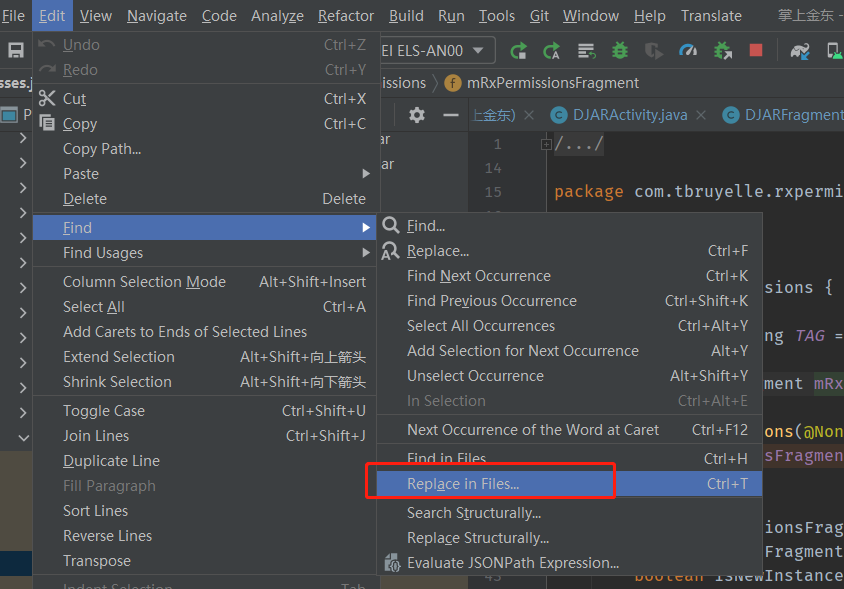

# Permission_aim_tip

# 作用

因为越来越严格的隐私政策要求，需要在申请权限的时候，告知用户需要该权限的目的。为了能快速适配已有项目，需要一个能自动感知权限申请，并显示的原因的框架。于是编写了该框架。

# gradle 引入

在项目根目录的build.gradle文件中配置研发中心的maven

```groovy
allprojects {
    repositories {
        google()
        jcenter()
     
        //研发中心的maven库
        maven {url 'http://mvn.devdemo.trs.net.cn/repository/maven-public/'}
    }
}

```

在需要使用的moudle中引入 

## android X


```groovy
  	//权限用途提醒库
    api 'com.trs.app:permission-aim-tip:1.0.8'

```

## support

**注意在support版本中，使用了自定义的rxpermission,如果和项目已有的rxpermission冲突，删除项目中的gradle引入即可**

```groovy
  	//权限用途提醒库 support版本
    api 'com.trs.app:permission-aim-tip-support:1.1.0'
```


自定义版本的rxpermission，使用**ActivityCompat**来获取权限，包名是**com.tbruyelle.rxpermissions2.RxPermissions**可以和网上的rxpermission无缝替换。

```groovy
    implementation 'com.trs.app:rxpermission:1.0.0'
```

 这个库的包名是**com.tbruyelle.rxpermissions.RxPermissions** 如果项目中用到的是**com.tbruyelle.rxpermissions2.RxPermissions**

可以使用Android Studio的全局替换功能




填入如下参数即可


替换的参数

```
import com.tbruyelle.rxpermissions2.RxPermissions;

import com.tbruyelle.rxpermissions.RxPermissions;
```


# 效果


# 特点

1. 100%拦截fragment的权限请求
2. 100%拦截 RxPermission的权限请求(因为RxPermission就是基于Fragment)
3. 方便配置，使用json配置
4. 集成简便，一行代码即可。
5. 可定制UI

# 使用

## 注册代理


只需要在Application中注册即可使用

```java
public class MyApp  extends Application {

    @Override
    public void onCreate() {
        super.onCreate();
        //注册代理，一句话即可使用
         PermissionAimTipHelper.init(new TRSTipShowController
                (new RawAimTipAdapter(this, R.raw.permission_aim_description)));
    }
}
```

## 类说明

1. 1. | 类名                     | 作用                                                         | 备注                                                         |
      | ------------------------ | ------------------------------------------------------------ | ------------------------------------------------------------ |
      | PermissionAimTipHelper   | 核心类，用于拦截通过ActivityCompat调用权限的过程，唯一构造参数为**AimTipShowController** | 必须调用init方法，之后才能通过getInstance获取实例。否则会报错。 |
      | **AimTipShowController** | 接口，在拦截到权限请求的时候，通过该类来显示提示信息。       |                                                              |
      | TRSTipShowController     | AimTipShowController的实现类，需要两个构造参数,其中之一是**AimTipAdapter**，通过AimTipAdapter将用户申请的权限转换为可以显示的语义化文字。还有一个是**DialogStyleData** 可以指定dialog的样式，可以缺省。 |                                                              |
      | **AimTipAdapter**        | 抽象类，定义了从android权限到需要显示信息的抽象过程          |                                                              |
      | RawAimTipAdapter         | AimTipAdapter的实现类，实现了加载raw目录下的配置文件         |                                                              |
      | DialogStyleData          | 用来保存dialog的布局文件id，和item的布局文件id ，以此来实现样式的自定义 |                                                              |
      |                          |                                                              |                                                              |

      


## 填写配置文件


其中的**R.raw.permission_aim_description** 是配置文件的id （保存在raw文件夹下）。配置文件如下

```json
[
  {
    "androidPermissionNames": [
      "android.permission.ACCESS_FINE_LOCATION",
      "android.permission.ACCESS_COARSE_LOCATION"
    ],
    "showPermissionName": "定位 GPS定位，WIFI定位",
    "permissionAimDescription": "用于新闻下微站展示,自动定位区县栏目展示场景"
  },
  {
    "androidPermissionNames": [
      "android.permission.WRITE_EXTERNAL_STORAGE",
      "android.permission.READ_EXTERNAL_STORAGE"
    ],
    "showPermissionName": "内存读，写",
    "permissionAimDescription": "用于APP写入/下载/保存/读取图片、文件等信息"
  },
  {
    "androidPermissionNames": [
      "android.permission.CAMERA"
    ],
    "showPermissionName": "访问摄像头",
    "permissionAimDescription": "用于拍照、录制视频、扫一扫AR识别等场景"
  },
  {
    "androidPermissionNames": [
      "android.permission.RECORD_AUDIO"
    ],
    "showPermissionName": "录音功能",
    "permissionAimDescription": "通过手机和耳机的麦克 用于录音、语音检索等场景"
  }

]
```

### 配置说明

| 字段名称                 | 用途                                                         |
| ------------------------ | ------------------------------------------------------------ |
| androidPermissionNames   | 用来配置对应的权限，如果用户申请的权限包括在其中。那么就会提示用户。必须是**Manifest.permission**中定义的常量 |
| showPermissionName       | 用于显示给用户看的权限名称                                   |
| permissionAimDescription | 权限目的的描述                                               |

## Activity中使用 

**直接使用Activity的requestPermissions方法**，将无法拦截。需要使用以下方式请求权限才能拦截

```java
  ActivityCompat.requestPermissions(this, locationPermission, 100);
```

其中的ActivityCompat是Android本身的适配库


## 样式自定义

原理是通过指定布局ID来替换样式，只需要在布局ID中出现以下控件即可。

```xml
<?xml version="1.0" encoding="utf-8"?>
<resources>
    <!--用来获取recycleView的id,控件必须是RecycleView-->
    <item name="aim_tip_id_recycle_view" type="id"/>
    <!--在item布局中用于显示权限名称,控件必须是TextView-->
    <item name="aim_tip_id_item_title" type="id"/>
    <!--在item布局中用于显示权限的目的,控件必须是TextView-->
    <item name="aim_tip_id_item_content" type="id"/>
</resources>
```

设置样式

```java

    DialogStyleData dialogStyleData = new DialogStyleData(R.layout.custom_dialog, DialogStyleData.USE_DEFAULT_STYLE);
                //修改样式
                PermissionAimTipHelper.getInstance().setShowController(new TRSTipShowController(new RawAimTipAdapter(v.getContext(), R.raw.permission_aim_description), dialogStyleData));yleData));
```


# 运行Demo

更多使用细节请参考这个项目，这是一个Demo项目。可以运行，如果提示gradle变量找不到，直接注释即可。这些代码是用来上传maven的。和demo运行无关。


